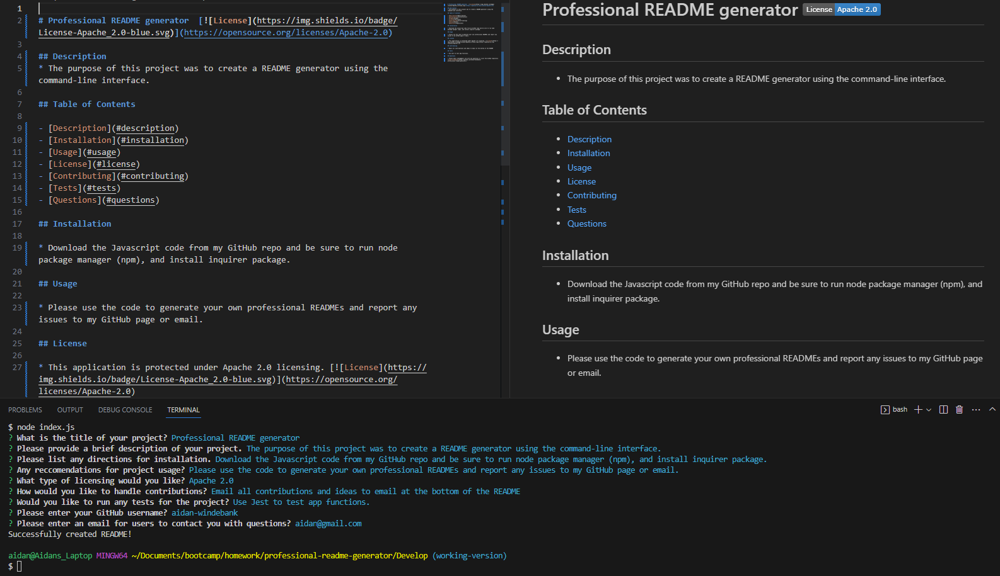

# Professional README Generator 

The following is a proffessional README generator that will generate high quality README's to be included with any newly created application.

## Purpose of Assignment
 - The main focus of this assignment was utilizing node.js to make an automatic README generator given usuer input in a command-line application.
 - The user will first download the code onto their computer, install node package manager and inquirer.
 - The user will invoke the application but typing 'node index.js' in the command line.
 - The user will go through all the questions to provide the necessary information for the README file, and the app will insert all this information into a usable proffessional README.

## Instructions for the User
 - Please use app and comment on any errors.

## Screen Shot of Working Application

## Link to GitHub Repository
[Click Here to View GitHub Repo](https://github.com/Aidan-Windebank/professional-readme-generator)